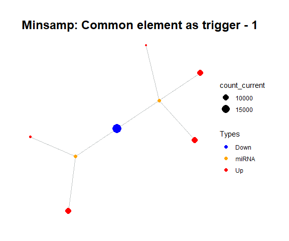
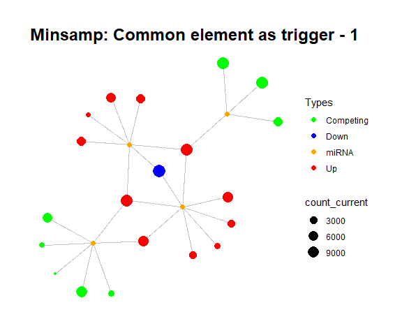

```{r setup, include = FALSE}
knitr::opts_chunk$set(
  collapse = TRUE,
  comment = "#>"
)
```

## ceRNAnetsim

```{r, message=FALSE, warning= FALSE}
#install.packages("devtools")
#devtools::install_github("selcenari/ceRNAnetsim")

library(ceRNAnetsim)
```

```{r, echo=FALSE, message= FALSE, warning=FALSE}
library(png)
```

# What is the problem or point?

In the `ceRNAnetsim` package, regulations of miRNA:target pairs are observed via direct or indirect interactions of elements in network. In this approach, change in expression level of single gene or miRNA can affect the whole network via "ripple effect". So, when the change is applied the system, it affects to primary neighborhood firstly, and then propagates to further neighborhoods.

In the simple interaction network like *minsamp*, the ripple effect could be observed when expression level of *Gene4* changes and subsequently effecting other genes. In the non-complex networks like *minsamp*, the steady-state condition can be provided easily, after network disturbed.


```{r, fig.height=5, fig.width=6, warning=FALSE, message=FALSE, fig.show='hide'}
data("minsamp")

minsamp %>%
  priming_graph(competing_count = Competing_expression, 
                miRNA_count = miRNA_expression) %>%
  update_how("Gene4",2) %>%
  simulate_vis(title = "Minsamp: Common element as trigger", cycle = 15)


minsamp %>%
  priming_graph(competing_count = Competing_expression, 
                miRNA_count = miRNA_expression) %>%
  update_how("Gene4",2) %>%
  simulate(cycle = 5)
```



For example, in *minsamp* dataset, the steady-state is occurred at iteration-14 (as seen above: after iteration-13, it is observed that there are only orange (miRNAs) and green (competing genes) nodes in network. In this case, genes have new regulated (steady) expression values while expression values of microRNAs are same in comparison with initial case.).

However, when network is larger and interactions are more complex, the number of iterations required to reach steady-state may increase. While at cycle 14 *minsamp* dataset has reached steady-state, the *midsamp* (middle sized sample) dataset has not reached steady-state after 15 cycles. In the example below, in *midsamp* data, *Gene17* is upregulated 2 fold as a trigger and simulation is run for 15 cycles.

```{r}
data("midsamp")

midsamp
```

```{r, fig.height=5, fig.width=6, warning=FALSE, message=FALSE, fig.show='hide'}
midsamp %>%
  priming_graph(Gene_expression, miRNA_expression) %>%
  update_how("Gene17",2) %>%
  simulate_vis(title = "Midsamp: Gene with higher degree as trigger", 15)
```



Guessing or performing trial and error for large networks is not practical, thus we developed a function which calculates optimal iteration in a network after trigger and simulation steps. `find_iteration()` function analyses the simulated graph and suggests the iteration at which maximum number of nodes are affected. An important argument is `limit` which sets the threshold below which is considered "no change", in other words, any node should have level of change greater than the threshold to be considered "changed". Please be aware that small threshold values will cause excessively long calculation time especially in large networks.

In the example below, *Gene2* is upregulated 2-fold and then iteration number at which maximum number of nodes affected will be calculated. The search for iteration number will go up to 50. Also, since we are searching for maximal propagation, limit is set to zero.

```{r}
midsamp %>%
  priming_graph(Gene_expression, miRNA_expression) %>%
  update_how("Gene2",2) %>%
  simulate(50) %>% 
  find_iteration(limit=0)


minsamp
```

Or

```{r, include = FALSE}

#You can edit the dataset manually. You can change Gene2 expression value as 20000 and save that as a new dataset (midsamp_new_counts)

#edit(midsamp)-> midsamp_new_counts

#midsamp_new_counts%>%
#  select(Competing=Genes, miRNA= miRNAs, Competing_count=Gene_expression, miRNA_count= miRNA_expression)->midsamp_new_counts


#use_data(midsamp_new_counts, overwrite = TRUE)

```

You can use the dataset that includes new expression values of miRNAs and genes.

```{r}
data("midsamp_new_counts")

midsamp %>%
  priming_graph(Gene_expression, miRNA_expression) %>%
  update_variables(current_counts = midsamp_new_counts) %>%
  simulate(50) %>% 
  find_iteration(limit=0)
```

`find_iteration()` function will return a single number: the iteration number at which maximum propagation is achieved. If `plot=TRUE` argument is used then the function will return a plot which calculates percent of perturbed nodes for each iteration number. The latter can be used for picking appropriate number of cycles for `simulate()` function.

```{r, fig.align='center', fig.width=5, fig.height=3, dpi= 120}
midsamp %>%
  priming_graph(Gene_expression, miRNA_expression) %>%
  update_how("Gene17",2) %>%
  simulate(50) %>% 
  find_iteration(limit=0)

```

## Find appropriate iteration number with `find_iteration` and then simulate accordingly

As shown in plot above, if "Gene17" is upregulated 2-fold, the network will need around 22 iterations to reach the steady-state. Since we have an idea about appropriate iteration number, let's use `simulate()` function and iterate for 25 cycles using same trigger (Gene17 2-fold):

```{r, fig.height=5, fig.width=6, warning=FALSE, message=FALSE, fig.show='hide'}
midsamp %>%
  priming_graph(Gene_expression, miRNA_expression) %>%
  update_how("Gene17", 2) %>%
  simulate_vis(title = "Midsamp: Gene17 2 fold increase, 25 cycles", 25)
```


The workflow that is aforementioned in this vignette should be considered as suggestion. Because the `cycle` is a critical argument that is used with `simulate()` function and affects results of analysis. In light of this vignette and functions, the approach can be developed according to dataset.

