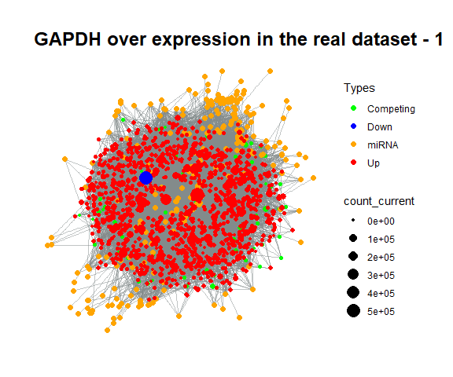

```{r setup, include = FALSE}
knitr::opts_chunk$set(
  collapse = TRUE,
  comment = "#>"
)
```

## Installation of ceRNAnetsim

```{r, message=FALSE, warning=FALSE}
#install.packages("devtools")
#devtools::install_github("selcenari/ceRNAnetsim")


library(ceRNAnetsim)
```

```{r, echo=FALSE, message= FALSE, warning=FALSE}
library(rlang)
library(dplyr)
library(tidyr)
library(stringr)
library(stringi)
library(tidyverse)
library(ggplot2)
library(tidygraph)
library(igraph)
library(ggraph)
library(purrr)
library(future)
library(furrr)
library(png)
```

# What is the *huge_example* dataset? TCGA_A7_A0CE

Interactions between miRNAs and their targets can be analysed after the integration of miRNA and targets via various datasets. As an example, we obtained the *huge_example* dataset. It was obtained though integration of next-generation RNA sequencing data of a cancer patient (TCGA_A7_A0CE from TCGA: breast cancer patient) and the high-throughput miRNA:target determination datasets. 

```{r}
data("huge_example")


head(huge_example)

```

## Select the node.

The node that starts to simulation is determined according to the point of the research. 

As an example, we eliminated some nodes for making an understandable process. For this, we selected the most interacted nodes in network as followings:

```{r}
huge_example%>%
  group_by(competing)%>%
  count()%>%
  filter(n > 5)%>%
  inner_join(huge_example, by = "competing")%>%
  select(-n)%>%
  distinct()%>%
  as.data.frame()-> clear_example

head(clear_example)
```

On the other hand, we chose also the node *GAPDH* according to interaction count of the nodes. With the simulation, the graph was visualized after node *GAPDH* was increased to five fold.

```{r, fig.height=5, fig.width=6, fig.align='center', warning=FALSE}

clear_example%>%
  priming_graph(competing_count = competing_counts, miRNA_count = mirnaexpression_normal, aff_factor = Energy)%>%
  update_nodes(once = TRUE)%>%
  update_how("GAPDH", 5)%>%
  update_nodes()%>%
  vis_graph(title = "Disturbtion of GAPDH gene node")

```

The graph was visualized after the disturbtion of GAPDH gene. This disturbtion is used as trigger in the network.

```{r, fig.height=5, fig.width=6, fig.align='center', warning=FALSE, fig.show='hide'}
clear_example%>%
  priming_graph(competing_count = competing_counts, miRNA_count = mirnaexpression_normal, aff_factor = Energy)%>%
  update_nodes(once = TRUE)%>%
  update_how("GAPDH", 5)%>%
  update_nodes()%>%
  simulate_vis(title = "GAPDH over expression in the real dataset", 3)

```



It was shown the conditions after the first disturbtion of GAPDH gene. 

- In the first graph, the responses of the other competing elements to the GAPDH disturbtions were obtained  increased amount, although the decreased expression level of GAPDH was determined.

- The changing regulations (up or down) were observed as a result of interactions in the second graph.

- When three graphs were carefully compared to each other, it was seen that the regulations are changed continuously.


