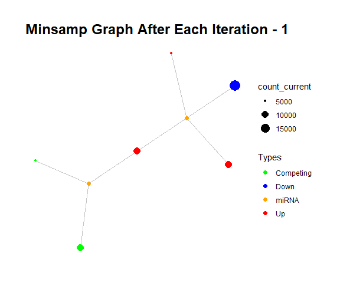

```{r setup, include = FALSE}
knitr::opts_chunk$set(
  collapse = TRUE,
  comment = "#>"
)
```


# Introduction

This vignette demonstrates how to analyse miRNA:Competing interactions via `ceRNAnetsim` package. The perturbations in the miRNA:target interactions are handled step by step in `ceRNAnetsim`. The package calculates and simulates regulation of miRNA:competing RNA interactions based on amounts of miRNA and the targets and interaction factors.

The `ceRNAnetsim` works by executing following steps:

- The input dataset is prepared for analysis. The first variable is arranged as competing and the second as miRNA.
- The dataset is primed with `priming_graph()` function so that it's converted into a graph. This function makes calculations that are depended on miRNA amount, target (competing) amount and the interaction factors. It determines the efficiency of miRNA to each target and saves that values as edge data. All calculations are performed in edge data. After that, results of calculations are used in node data.
- Now, the change in expression level of either miRNA or competing RNA can be introduced with `update_variables()` or `update_how()` functions.
- The calculated values in edge are carried to node data through a helper function `update_nodes()`.
- The change is perceived as a trigger and network-wise calculations are performed.
- The trigger is used for simulation of regulations in `simulate()` or `simulate_vis()`.
- These processes can generate various outputs such as graphs or graph objects.


The workflow of `ceRNAnetsim` are shown as following:

```{r pressure, echo=FALSE, fig.align='center', fig.width=4, fig.height=3, dpi=120}

knitr::include_graphics("gifs/model_vignette.png")
```

## Installation of ceRNAnetsim

```{r, message=FALSE,warning=FALSE}
#install.packages("devtools")
#devtools::install_github("selcenari/ceRNAnetsim")

library(ceRNAnetsim)
```

```{r, echo=FALSE, message= FALSE, warning=FALSE}
library(png)
```

## Load the minimal sample

In this vignette, the model functions are demonstrated with minimal sample dataset.
*minsamp* is a sample dataset that includes 6 genes, 2 miRNAs and interaction factors of miRNA:gene pairs.

```{r}
data("minsamp")

minsamp
```

### About preparing data

The table used in minimal sample might look complicated thus let's see how it's constructed.

The table is actually constructed by merging three different tables:

* gene expression data
* miRNA expression data
* miRNA:gene pairs (might **optionally** contain data about the interaction)

So, the `minsamp` table is constructed by merging following tables:

```{r echo=FALSE}
# datapasta::tribble_paste()
gene_expression <- tibble::tribble(
                  ~competing, ~Competing_expression,
                     "Gene1",                 10000,
                     "Gene2",                 10000,
                     "Gene3",                  5000,
                     "Gene4",                 10000,
                     "Gene5",                  5000,
                     "Gene6",                 10000
                  )
```

```{r}
gene_expression
```

```{r echo=FALSE}
# datapasta::tribble_paste()
mirna_expression <- tibble::tribble(
                             ~miRNA, ~miRNA_expression,
                             "Mir1",              1000,
                             "Mir2",              2000
                             )
```

```{r}
mirna_expression
```

Third table should contain miRNA:gene interactions. This table can be as simple as

```{r echo=FALSE}
#datapasta::tribble_paste()
interaction_simple <- tibble::tribble(
                     ~competing, ~miRNA,
                        "Gene1", "Mir1",
                        "Gene2", "Mir1",
                        "Gene3", "Mir1",
                        "Gene4", "Mir1",
                        "Gene4", "Mir2",
                        "Gene5", "Mir2",
                        "Gene6", "Mir2"
                     )
```

```{r}
interaction_simple
```

or it can contain extra information about each miRNA:gene interaction

```{r echo=FALSE}
#datapasta::tribble_paste()
interaction_complex <-tibble::tribble(
     ~competing, ~miRNA, ~seed_type, ~region, ~energy,
        "Gene1", "Mir1",       0.43,     0.3,     -20,
        "Gene2", "Mir1",       0.43,    0.01,     -15,
        "Gene3", "Mir1",       0.32,     0.4,     -14,
        "Gene4", "Mir1",       0.23,     0.5,     -10,
        "Gene4", "Mir2",       0.35,     0.9,     -12,
        "Gene5", "Mir2",       0.05,     0.4,     -11,
        "Gene6", "Mir2",       0.01,     0.8,     -25
     )
```

```{r}
interaction_complex
```

By joining these 3 different tables, third table being simple or complex, your data will be ready for analysis.

## Convert the dataset to graph

minimal sample `minsamp` is processed with `priming_graph()` function in first step. This provides conversion of dataset from data frame to graph object. This step comprises of:

- The competing elements (Genes in *minsamp*) are grouped according to the miRNAs they are associated with.
- In graph object, the **optional** interaction factors are processed and graded within the groups.
- The amounts (expressions) of miRNAs are distributed according to competing:total competing ratio.
- miRNA efficiency in steady-state is calculated by taking into account of expression distribution and effecting factors. The **optional** factors might have two types of effect; 1) affinity, 2) degradation effect. Any column which has effect on affinity should be provided as a vector to `aff_factor` argument and any column that effects degradation of target RNA should be as a vector to `deg_factor` argument. 

```{r}
priming_graph(minsamp, 
              competing_count = Competing_expression, 
              miRNA_count = miRNA_expression,
              aff_factor = c(energy, seed_type), 
              deg_factor = region)
```

In the processed data, the values are carried as node variables and many more columns are initialized which are to be used in subsequent steps.

## Change expression level of one or more nodes in the graph

In the steady-state, the miRNA degradation effect on gene expression is assumed to be stable (*i.e.* in equilibrium). But, if one or more nodes have altered expression level, the system tends to reach steady-state again. 

The `ceRNAnetsim` package utilizes two methods to simulate change in expression level, `update_how()` and `update_variables()` functions provide unstable state from which calculations are triggered to reach steady-state. 

### Method 1: change expression level of single node

If updating expression level of single node is desired then  `update_how()` function should be used. In the example below, expression level of Gene4 is increased 2-fold.
  
```{r results='hold'}
minsamp %>%
   priming_graph(competing_count = Competing_expression, 
                 miRNA_count = miRNA_expression,
                 aff_factor = c(energy, seed_type), 
                 deg_factor = region) %>%
   update_how(node_name = "Gene4", how = 2) %>% 
   activate(edges)%>%
   # following line is just for focusing on necessary
   # columns to see the change in edge data
   select(3:4,comp_count_pre,comp_count_current)
```

### Method 2: update expression level of all nodes

The `update_variables()` function uses an external dataset which has number of rows equal to number of nodes in graph. The external dataset might include changed and unchanged expression values for each node. 

Load the `new_count` dataset (provided with package sample data) in which expression level of Gene2 is increased 2 fold (from 10,000 to 20,000). Note that variables of the dataset included updated variables must be named as "Competing", "miRNA", "miRNA_count" and "Competing_count.

```{r}
data(new_counts) 
new_counts
```

`update_variables()` function replaces the existing expression values with new values. The function checks for updates in all rows after importing expression values, thus it's possible to introduce multiple changes at once. 

```{r}
minsamp %>%
   priming_graph(competing_count = Competing_expression, 
                 miRNA_count = miRNA_expression,
                 aff_factor = c(energy, seed_type), 
                 deg_factor = region) %>%
   update_variables(current_counts = new_counts)

```

## Update the node variables with edge variables.

The functions `update_variables()` and `update_how()` updates edge data. In these functions, `update_nodes()` function is applied in order to reflect changes in edge data over to node data. In other words, if there's a change in edge data, nodes can be updated accordingly with `update_nodes()` function.

```{r}
minsamp %>%
  priming_graph(competing_count = Competing_expression, 
                miRNA_count = miRNA_expression,
                aff_factor = c(energy, seed_type), 
                deg_factor = region) %>%
  update_how("Gene4", how = 2) 

# OR
# minsamp %>%
#   priming_graph(competing_count = Competing_expression, 
#                 miRNA_count = miRNA_expression,
#                 aff_factor = c(energy, seed_type), 
#                 deg_factor = region) %>%
#   update_variables(current_counts = new_counts) 
```


## Simulate the model

Change in expression level of one or more nodes will trigger a perturbation in the system which will effect neighboring miRNA:target interactions. The effect will propagate and iterate over until it reaches steady-state.

With `simulate()` function the changes in the system, are calculated iteratively. For example, in the example below, simulation will proceed ten cycles only.

```{r}
minsamp %>%
  priming_graph(competing_count = Competing_expression, 
                miRNA_count = miRNA_expression,
                aff_factor = c(energy, seed_type), 
                deg_factor = region) %>%
  update_how("Gene4", how = 2) %>%
  simulate(cycle=10)
```

`simulate()` saves the expression level of previous iterations in list columns in edge data. The changes in expression level throughout the simulate cycles are accessible with standard `dplyr` functions. For example:
  
```{r}
minsamp %>%
   priming_graph(competing_count = Competing_expression, 
                 miRNA_count = miRNA_expression,
                 aff_factor = c(energy, seed_type), 
                 deg_factor = region) %>%
   update_how("Gene4", how = 2) %>%
   simulate(cycle=10) %>%
   activate(edges) %>%       #from tidygraph package 
   select(comp_count_list, mirna_count_list) %>%
   activate(nodes)   
```

Here, `comp_count_list` and `mirna_count_list` are list-columns which track changes in both competing RNA and miRNA levels. In the sample above, "Gene4" has initial expression level of 10000 (after trigger, it's initial expression is 20000) and reached level of 19806 at 9th cycle (count_pre) and also stayed at 19806 in last cycle (count_current). The full history of expression level for Gene4 is as follows:

```{r echo=FALSE, warning=FALSE, message=FALSE}
minsamp %>%
   priming_graph(competing_count = Competing_expression, 
                 miRNA_count = miRNA_expression,
                 aff_factor = c(energy, seed_type), 
                 deg_factor = region) %>%
   update_how("Gene4", how = 2) %>%
   simulate(cycle=10) %>%
   activate(edges) %>%       #from tidygraph package 
   select(comp_count_list, mirna_count_list) %>%
   as_tibble() %>% 
   filter(from==4, to==7) %>% 
   pull(comp_count_list) %>% 
   .[[1]] %>% 
   round()


#TODO: this problem was not occured. <!-- #TODO gene5 stays at 5000 and gene6 stays at 10000 for 10 cycles, is that normal?) When I run that chunk, this is not occured -->you can see at following:
minsamp %>%
   priming_graph(competing_count = Competing_expression, 
                 miRNA_count = miRNA_expression,
                 aff_factor = c(energy, seed_type), 
                 deg_factor = region) %>%
   update_how("Gene4", how = 2) %>%
   simulate(cycle=10) %>%
   activate(edges)%>%
   select(comp_count_current, comp_count_pre)%>%
   as_tibble()

```

## Visualisation of the graph

The `vis_graph()` function is used for visualization of the graph object. The initial graph object (steady-state) is visualized as following:
  
```{r, fig.height=4, fig.width=5, warning=FALSE, dpi= 120, fig.align='center'}
minsamp %>%
   priming_graph(competing_count = Competing_expression, 
                 miRNA_count = miRNA_expression,
                 aff_factor = c(energy, seed_type), 
                 deg_factor = region) %>%
   vis_graph(title = "Minsamp initial Graph")
```

Also, The graph can be visualized at any step of process, for example, after simulation of 3 cycles the graph will look like:

```{r, fig.height=4, fig.width=5, warning=FALSE, dpi= 120, fig.align='center'}
minsamp %>%
   priming_graph(competing_count = Competing_expression, 
                 miRNA_count = miRNA_expression,
                 aff_factor = c(energy, seed_type), 
                 deg_factor = region) %>%
   update_variables(current_counts = new_counts) %>%
   simulate(3) %>%
   vis_graph(title = "Minsamp Graph After 3 Iteration")
```

On the other hand, the network of each step can be plotted individually by using `simulate_vis()` function. `simulate_vis()` processes the given network just like `simulate()` function does while saving image of each step.
  
```{r, fig.height=4, fig.width=5, warning=FALSE, message=FALSE, fig.show='hide'}
minsamp %>%
   priming_graph(competing_count = Competing_expression, 
                 miRNA_count = miRNA_expression,
                 aff_factor = c(energy, seed_type), 
                 deg_factor = region) %>%
   update_variables(current_counts = new_counts) %>%
   simulate_vis(3, title = "Minsamp Graph After Each Iteration")
```



Note: Minsamp Graph After Each Iteration gif was obtained by online service. Actually, workflow gives the frames which include condition of each iteration. Note that you must use a terminal or online service, if you want to generate the animated gif.

See the other vignettes for more advanced examples.
